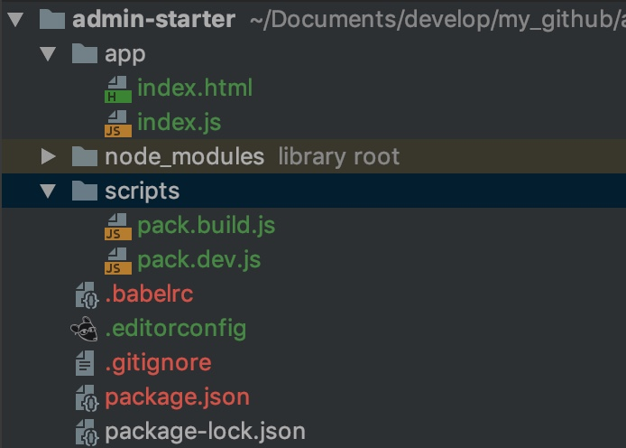
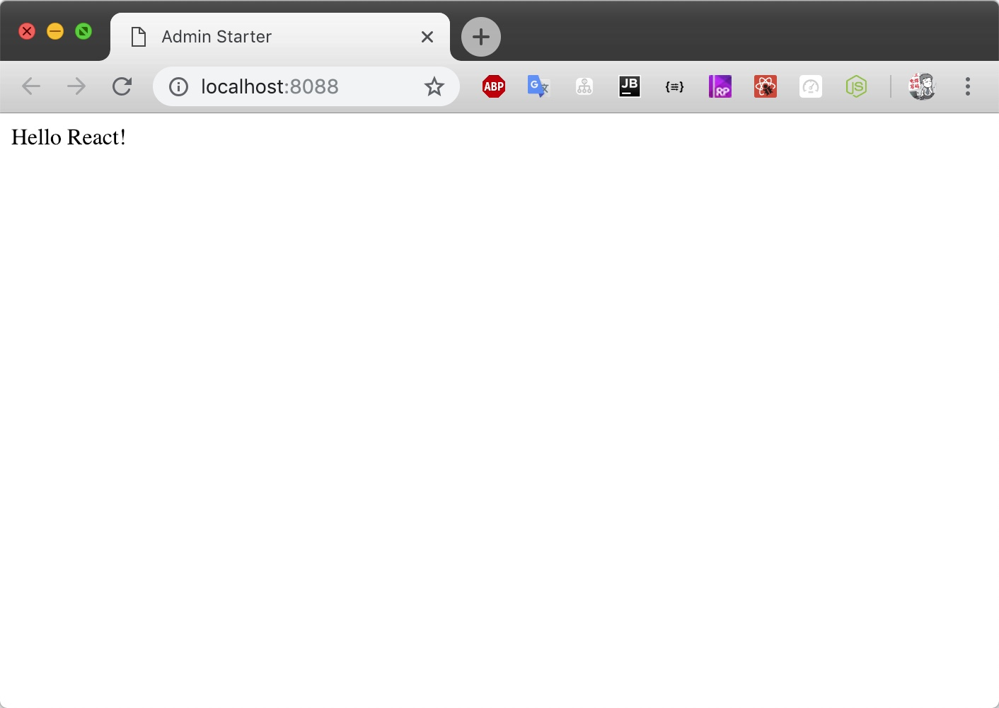
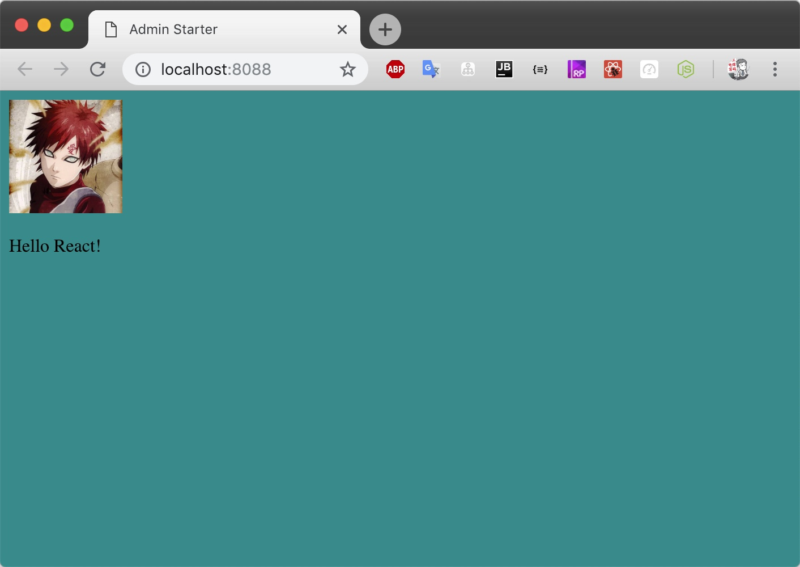
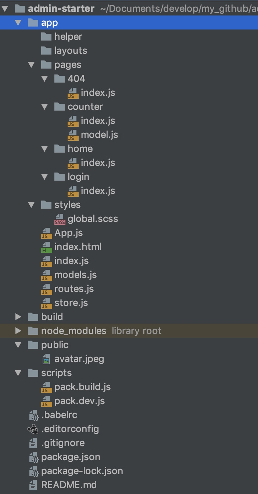
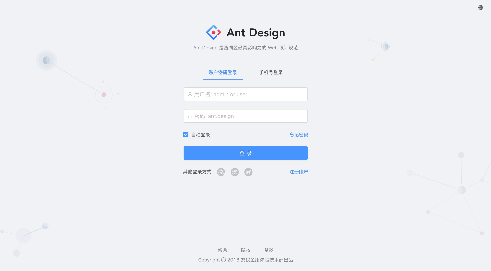
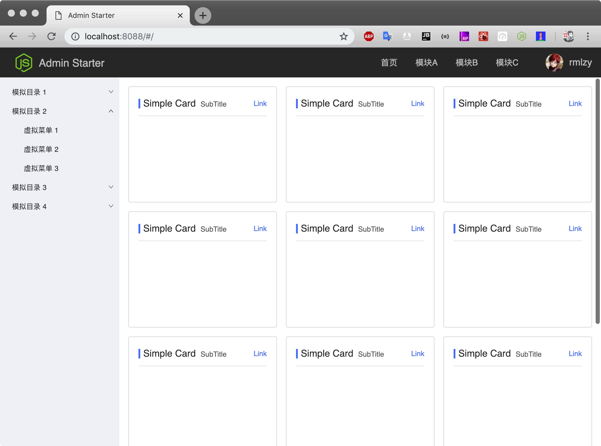
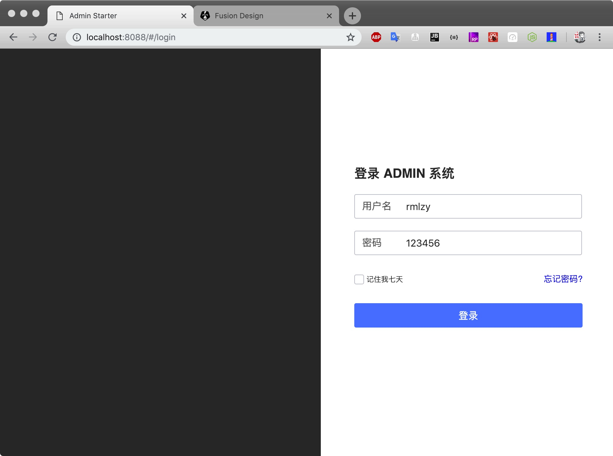
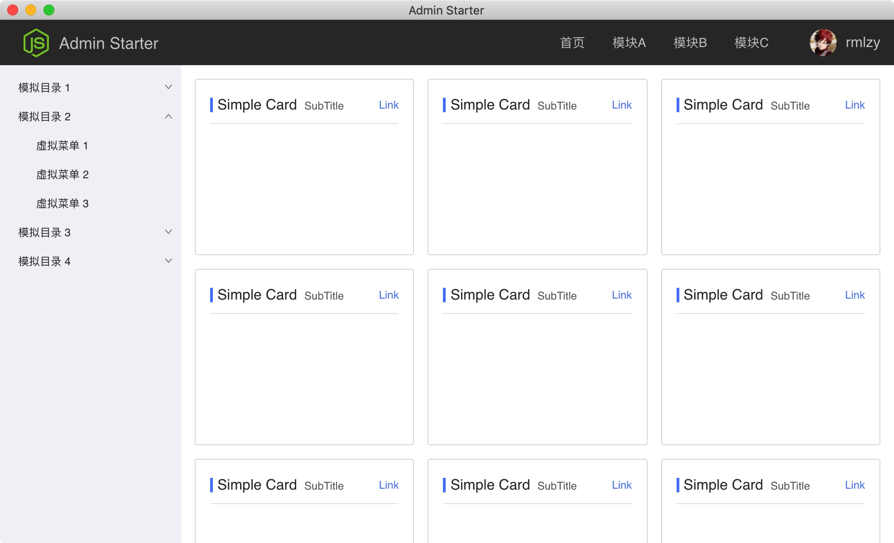

> 从零开始搭建一个基于 React 的 SPA 框架, 适用于中后台系统.

框架特性:
+ **干净整洁, 没有不必要的配置**
+ 标准的[代码风格](https://standardjs.com/)
+ 成熟的项目结构
+ 使用最新的 Webpack@4.x
+ 使用最新的 React@16.x
+ 使用最新的 React-router@4.x
+ 使用最新的 Babel@7.x
+ 支持 ECMAScript 2016
+ 基于 Rematch 优化 redux 实践
+ 支持 Sass/style-in-js
+ 热更新
+ 集成 Fusion UI
+ 代码分割
+ 打包优化
+ 借助 Electron 打包成桌面端应用
+ 使用 ESLint 约束代码风格
+ 多种Layout

## 比较
+ [dva](https://github.com/dvajs/dva); 参考 [React + Redux 最佳实践](https://github.com/sorrycc/blog/issues/1)
+ [react-boilerplate](https://github.com/react-boilerplate/react-boilerplate);
+ [react-starter-kit](https://github.com/kriasoft/react-starter-kit);
+ [create-react-app](https://github.com/facebook/create-react-app);

## 预备知识
1. `dependencies` 和 `devDependencies`
2. 区别
    1. react
    2. react-dom
    2. react-router
    3. react-router-dom
    3. redux
    4. react-redux
    5. react-router-redux
    6. connected-react-router
4. `node` 基础, 参照 [七天学会NodeJS](https://nqdeng.github.io/7-days-nodejs/)
    1. `__dirname` 和 `process`
    2. `path`
    3. `fs`
    4. CommonJS规范
  
5. 模块化: 
    1. CommonJS
    2. AMD(RequireJS)
    3. UMD
    4. ES6模块化

# 开始
## 1. 创建一个空项目

```sh
mkdir admin-starter
```

## 2. 初始化npm

```sh
cd admin-starter
npm init
# 自行配置, 最后生成 package.json
```

## 3. 配置 Git 忽略文件

```sh
cd admin-starter
touch .gitignore
```

`.gitignore` 文件如下: [语法规则](https://git-scm.com/docs/gitignore)

```text
build
node_modules
package-lock.json
.DS_Store
npm-debug.log
.idea
.vscode
```

## 4. 连接到 Git 仓库

```sh
cd admin-starter
git init
git remote add origin <your_git_url>
git add .
git commit -m 'Init Repos'
git push -u origin master
```

## 5. 安装 Webpack 所需依赖, 可以参考 [webpack本地安装](https://www.webpackjs.com/guides/installation)

```sh
cd admin-starter
npm i --save-dev webpack webpack-cli webpack-dev-server cross-env
```

说明:
+ [webpack](https://github.com/webpack/webpack): 构建工具;
+ [webpack-cli](https://github.com/webpack/webpack-cli): webpack 命令行工具;
+ [webpack-dev-server](https://github.com/webpack/webpack-dev-server): 启动服务, 支持热更新, 支持proxy;
+ [cross-env](https://github.com/kentcdodds/cross-env): 跨平台设置 `NODE_ENV`;

## 6. 安装 React 所需依赖

```sh
npm i --save react react-dom prop-types
```

说明:
+ [react](https://github.com/facebook/react): React 库, 我们使用目前最新的 v16.7.0;
+ [react-dom](https://www.npmjs.com/package/react-dom): React DOM 库;
+ [prop-types](https://github.com/facebook/prop-types): 类型检查;

## 7. 安装 Babel, 可以参考 [Babel Use Guide](https://babeljs.io/docs/en/usage)

```sh
cd admin-starter
npm install --save-dev @babel/core @babel/cli @babel/preset-env @babel/preset-react
npm install --save @babel/polyfill
```

我们使用了超前的 JavaScript 语法, 这些语法存在浏览器兼容问题, 因此需要使用 Babel 将代码降级为浏览器支持的版本.

说明:
+ [@babel/core](https://github.com/babel/babel/tree/master/packages/babel-core): Babel 核心;
+ [@babel/cli](https://github.com/babel/babel/tree/master/packages/babel-cli): Babel 终端工具;
+ [@babel/preset-env](https://github.com/babel/babel/tree/master/packages/babel-preset-env): 根据环境预先配置 Babel, 我们会通过一个配置让 Babel 降级为指定的版本;
+ [@babel/preset-react](https://github.com/babel/babel/tree/master/packages/babel-preset-react): 如上, 专门适配 React;
+ [@babel/polyfill](https://github.com/babel/babel/tree/master/packages/babel-polyfill): 类似于涂料可以抹平墙上的各种洞, polyfill 可以帮我们抹平浏览器之间的兼容;

## 8. 创建 Babel 配置
Babel 支持多种[配置文件](https://babeljs.io/docs/en/configuration):
+ `.babelrc`
+ `babel.config.js`
+ `babel.json`

我们使用 `.babelrc`, 创建 `admin-starter/.babelrc` 并贴入以下内容:

```text
{
    "presets": [
        "@babel/preset-env",
        "@babel/preset-react"
    ]
}
```

另外, 我们需要装几个插件:

我们需要启动对 [ES6 Class 静态方法](http://es6.ruanyifeng.com/#docs/class#%E9%9D%99%E6%80%81%E6%96%B9%E6%B3%95) 的支持:
```bash
npm i --save-dev @babel/plugin-proposal-class-properties
```

我们需要启动对 [ES7修饰器](http://es6.ruanyifeng.com/#docs/decorator) 的支持:
```bash
npm i --save-dev @babel/plugin-proposal-decorators
```

我们需要启动对动态 import 的支持, 用来分包:
```bash
npm i --save-dev @babel/plugin-syntax-dynamic-import
```

我们需要引入 runtime 插件防止工具库重复, [了解更多](https://babeljs.io/docs/en/babel-plugin-transform-runtime/):
```bash
npm i --save @babel/runtime
npm i --save-dev @babel/plugin-transform-runtime
```

修改 `.babelrc`, 启动以上插件:

```text
{
    "presets": [
        "@babel/preset-env",
        "@babel/preset-react"
    ],
    "plugins": [
        [
            "@babel/plugin-proposal-decorators",
            {
                "legacy": true
            }
        ],
        "@babel/plugin-transform-runtime",
        "@babel/plugin-proposal-class-properties",
        "@babel/plugin-syntax-dynamic-import"
    ]
}

```

## 9. 创建目录结构

```sh
cd admin-starter

# 源码目录
mkdir app

# 脚本目录
mkdir scripts
touch scripts/pack.dev.js
touch scripts/pack.build.js
```

我们将 webpack 的配置分成了两份:
+ `pack.dev.js`: 开发环境
+ `pack.build.js`: 打包配置

另外, 为了区分环境, 我们需要借助 [cross-env](https://github.com/kentcdodds/cross-env) 设置 `NODE_ENV`.

## 10. 创建入口 html
简单来说, 单页应用就是只有一个 html 的应用, 通过 js 动态调整页面结构实现多路由的复杂系统.

创建 `admin-starter/app/index.html`, 并贴入以下内容:

```html
<!DOCTYPE html>
<html lang="en">
<head>
    <meta charset="UTF-8">
    <title>Admin Starter</title>
</head>
<body>

<!-- 项目将被挂载到 root 上 -->
<div id="root"></div>
</body>
</html>
```

## 11. 创建应用根组件
创建 `admin-starter/app/index.js`, 并贴入以下内容:

```js
import React, {Component} from 'react';
import ReactDOM from 'react-dom';
import PropTypes from 'prop-types';

class App extends Component {
    render() {
        return (
            <div>
                Hello React!
            </div>
        );
    }
}

const mountEl = document.getElementById('root');
ReactDOM.render(<App />, mountEl);
```

此时目录结构如下:



## 12. 配置 webpack
到目前为止, 我们的程序还无法启动, 我们先来写开发环境的配置.

webpack 简单来说:
1. 针对不同的环境
2. 用不同的 loader 处理不同后缀的文件
3. 结合一些插件
4. 输出文件

首先在 `admin-starter/package.json` 中添加一个 `scripts`:

```json
{
    "scripts": {
        "dev": "cross-env NODE_ENV=development webpack-dev-server --config ./scripts/pack.dev.js"
    }
}
```

`npm run dev` 脚本解读:
1. `npm` 会寻找 当前目录下的 `package.json` 中的 `scripts` 字段的 `dev` 字段;
2. 执行 `dev` 对应的字段值;
3. 执行过程
    1. 使用 cross-env 为当前的 node 进程加一个自定义变量: `NODE_ENV`, 这个变量值为: `development`, (webpack会读这个变量);
    2. 使用 webpack-dev-server 启动服务, 指定配置文件为: pack.dev.js

## 13. 编写开发脚本
要启动开发服务, 我们还需要安装两个依赖:

```sh
npm i --save-dev babel-loader html-webpack-plugin
```

说明:
+ [babel-loader](https://github.com/babel/babel-loader): 让 webpack 使用 babel;
+ [html-webpack-plugin](https://github.com/jantimon/html-webpack-plugin): 让 webpack 把服务启动指定的 html 中(`admin-editor/index.html`);

编写 `admin-starter/scripts/pack.dev.js` 如下:

```js
const path = require('path');
const webpack = require('webpack');
const HtmlWebPackPlugin = require('html-webpack-plugin');

/**
 * webpack 配置
 * https://webpack.js.org/configuration/#options
 */
const devConfig = {
    /**
     * 模式
     * https://webpack.js.org/concepts/mode/
     */
    mode: 'development',

    /**
     * 目标环境
     * https://webpack.js.org/configuration/target/#target
     */
    target: 'web',

    /**
     * 程序的入口
     * https://webpack.js.org/configuration/entry-context/#entry
     */
    entry: path.join(__dirname, '../app/index.js'),

    /**
     * 输出配置
     */
    output: {
        path: path.join(__dirname, '../build'),
        filename: '[name].js'
    },

    /**
     * 调试工具
     * https://webpack.js.org/configuration/devtool/
     */
    devtool: 'inline-source-map',

    /**
     * 开发服务配置
     * https://webpack.js.org/configuration/dev-server/
     */
    devServer: {
        host: 'localhost',
        port: '8088'
    },

    /**
     * 模块
     * https://webpack.js.org/configuration/module/
     */
    module: {
        rules: [
            {
                test: /\.(js|jsx)$/, // <= 正则表达式
                exclude: /node_modules/, // <= 排除目录, 缩小范围
                include: [              // <= 包含目录, 缩小范围
                    path.join(__dirname, '../app')
                ],
                use: 'babel-loader'
            }
        ]
    },

    plugins: [
        new HtmlWebPackPlugin({
            template: './app/index.html',
            filename: './index.html'
        }),
    ]
};

module.exports = devConfig;
```

## 14. 启动开发服务
执行 `npm run dev`, 输出如下:

```sh
$ npm run dev

> admin-starter@1.0.0 dev /admin-starter
> cross-env NODE_ENV=development webpack-dev-server --config ./scripts/pack.dev.js

ℹ ｢wds｣: Project is running at http://localhost:8088/
ℹ ｢wds｣: webpack output is served from /
ℹ ｢wdm｣: Hash: 43c81f2dc6a2fb569f1d
Version: webpack 4.29.0
Time: 1269ms
Built at: 01/23/2019 2:14:35 PM
...
ℹ ｢wdm｣: Compiled successfully.
```

此时打开 [localhost:8088](localhost:8088), 如果正常的话, 页面效果如下:



## 14. 扩展开发脚本
我们需要扩展 `admin-starter/scripts/pack.dev.js`, 以支持样式文件、图片资源、字体资源.

```sh
npm i --save-dev style-loader css-loader sass-loader file-loader
```

扩展 `pack.dev.js` 中的 `module.rules` 字段如下:

```sh
rules: [
    {
        test: /\.(js|jsx)$/,
        exclude: /node_modules/,
        include: [
            path.join(__dirname, '../app')
        ],
        use: [
            'babel-loader'
        ]
    },
    {
        test: /\.scss/,
        use: [
            'style-loader',
            'css-loader',
            'sass-loader'
        ]
    },
    {
        test: /\.(bmp|gif|jpg|jpeg|png|svg)$/,
        exclude: /node_modules/,
        use: [
            'file-loader'
        ]
    },
    {
        test: /\.(eot|otf|ttf|woff|woff2|svg)$/,
        exclude: /node_modules/,
        use: [
            'file-loader'
        ]
    }
]
```

> 注意: `use: ['style-loader', 'css-loader', 'sass-loader']` 的先后顺序.
webpack 的调用顺序是从右向左, 上一个 loader 把处理结果交给下一个 loader.
`sass-loader` 将 sass 转为 css, `css-loader` 将 css 转为 style, `style-loader` 将 style 转为 js字符串.

创建 `admin-starter/app/global.less`, 贴入以下样式:

```css
body {
    background: darkcyan;
}
```

在 `admin-starter/app/index.js` 中引入 `global.less`;

```js
import React, {Component} from 'react';
import ReactDOM from 'react-dom';
import PropTypes from 'prop-types';
import avatar from './avatar.png';
import './global.less'; // 思考如何转为 scope 样式?

class App extends Component {
    render() {
        return (
            <div>
                Hello React!
            </div>
        );
    }
}

const mountEl = document.getElementById('root');
ReactDOM.render(<App />, mountEl);
```

重启服务, 效果如下:



## 15. 编写打包脚本
我们需要将应用降级打包后使用, 打包过程涉及到代码的混淆和压缩, 静态资源的处理等.

```bash
# 压缩样式
npm i --save-dev mini-css-extract-plugin
# 压缩JS
npm i --save-dev terser-webpack-plugin
# 压缩样式中出现的图片、字体
npm i --save-dev optimize-css-assets-webpack-plugin
```

编写 `admin-starter/scripts/pack.build.js` 如下:

```js
const path = require('path'); // 思考为什么不用 import?
const webpack = require('webpack');
const TerserPlugin = require('terser-webpack-plugin');
const HtmlWebPackPlugin = require('html-webpack-plugin');
const MiniCssExtractPlugin = require('mini-css-extract-plugin');
const OptimizeCSSAssetsPlugin = require('optimize-css-assets-webpack-plugin');

const buildConfig = {
    mode: 'production',
    target: 'web',
    entry: path.join(__dirname, '../app/index.js'),
    output: {
        path: path.join(__dirname, '../build'),
        filename: '[name].js'
    },
    module: {
        rules: [
            {
                test: /\.(js|jsx)$/,
                exclude: /node_modules/,
                include: [
                    path.join(__dirname, '../app')
                ],
                use: [
                    'babel-loader'
                ]
            },
            {
                test: /\.scss/,
                use: [
                    MiniCssExtractPlugin.loader,
                    'css-loader',
                    'sass-loader'
                ]
            },
            {
                test: /\.(bmp|gif|jpg|jpeg|png|svg)$/,
                exclude: /node_modules/,
                use: [
                    'file-loader'
                ]
            },
            {
                test: /\.(eot|otf|ttf|woff|woff2|svg)$/,
                exclude: /node_modules/,
                use: [
                    'file-loader'
                ]
            }
        ]
    },
    plugins: [
        new HtmlWebPackPlugin({
            template: './app/index.html',
            filename: './index.html'
        }),
    ],
    optimization: {
        minimizer: [
            new TerserPlugin({
                terserOptions: {
                    ecma: 6,
                    compress: true,
                    output: {
                        comments: false,
                        beautify: false
                    }
                }
            }),
            new OptimizeCSSAssetsPlugin({})
        ]
    },
};

module.exports = buildConfig;
```

在 `package.json` 中添加 `build` 脚本:

```js
{
    "scripts": {
        "dev": "cross-env NODE_ENV=development webpack-dev-server --config ./scripts/pack.dev.js",
        "build": "cross-env NODE_ENV=production webpack --config ./scripts/pack.build.js"
    }
}
```

执行 `npm run build`, 如果正常的话, 可以在 `admin-starter` 中看到 `build` 文件夹.

在 build 文件夹下使用 [http-server](<https://github.com/indexzero/http-server>) 启动服务:

```js
cd admin-starter

# 注意这里是全局安装, admin-starter 不依赖 http-server
sudo npm i -g http-server
cd build
http-server

# 输出如下
Starting up http-server, serving ./
Available on:
  http://127.0.0.1:8080
  http://192.168.20.63:8080
  http://192.168.2.1:8080
Hit CTRL-C to stop the server
```

打开 <http://127.0.0.1:8080>, 如果正常的话, 可以看到和开发环境一致的界面.

## 16. 集成 Fusion UI
[@alifd/next](https://github.com/alibaba-fusion/next) 是 Alibaba Fusion Design 的官方 React 实现, 赋能企业中后台产品开发.

安装步骤可以参看 [Fusion 快速上手](https://fusion.design/component/doc/105).

```js
cd admin-starter
npm i --save moment @alifd/next
```

注意:
+ fusion 依赖 moment;
+ fusion 支持多种安装方式;
+ 我们使用 `babel-plugin-import` 插件实现按需引入;

安装:
```bash
npm i --save-dev babel-plugin-import
```

调整 `.babelrc` 如下:
```
{
    "presets": [
        "@babel/preset-env",
        "@babel/preset-react"
    ],
    "plugins": [
        [
            "@babel/plugin-proposal-decorators",
            {
                "legacy": true
            }
        ],
        "@babel/plugin-transform-runtime",
        "@babel/plugin-proposal-class-properties",
        "@babel/plugin-syntax-dynamic-import",
        [
            "babel-plugin-import",
            {
                "libraryName": "@alifd/next",
                "style": true
            }
        ]
    ]
}
```

## 17. 集成 [react-router](https://github.com/ReactTraining/react-router)
至此, 我们已经完成了一个只有一个页面的应用, 页面里包含一张图片和一个按钮.

`browserHistory` 和 `hashHistory` 的区别?

下面来集成 react-router 实现多路由, 我们使用 v4.3.1 版本:

```js
npm i --save react-router-dom
```

由于代码较多, 请参照 [commit](<https://github.com/rmlzy/admin-starter/commit/6efa642ac9bd6a4f184f0c1de1c0ac0ad276ca8e>).

## 18. 集成 [rematch](https://github.com/rematch/rematch)
为了处理复杂的数据, 我们需要引入 [redux](https://github.com/reduxjs/redux).

redux 默认的写法是比较繁琐的, 需要依次编写 reducer, action, action-type, dispatch 等.

我们使用 rematch 来简化操作, 下面来集成 rematch:

```js
npm i --save react-redux connected-react-router history
npm i --save @rematch/core
npm i --save @rematch/loading
```

说明:
+ [react-redux](https://github.com/reduxjs/react-redux): Redux 的 React 版本;
+ [history](https://github.com/ReactTraining/history): Manage session history with JavaScript;
+ [connected-react-router](https://github.com/supasate/connected-react-router): 绑定 Router 到 Redux;
+ [@rematch/core](https://github.com/rematch/rematch): Rematch 核心库;
+ [@rematch/loading](https://github.com/rematch/rematch/tree/master/plugins/loading): Rematch Loading 插件;

由于代码较多, 请参照 [commit](https://github.com/rmlzy/admin-starter/commit/d73aa3b812f81385fdc273de596af56619634fb9).

此时, 我们的项目结构如下:



## 19. 使用 ESLint 来约束代码
现在我们通过 [ESLint](https://eslint.org/) 来约束代码格式. // 思考如何约束 CSS 格式?

```sh
# eslint 基础库
npm i --save-dev eslint babel-eslint

# 使用标准配置
npm i --save-dev eslint-config-standard eslint-config-standard-react

# 开启对 babel, react, promise 的支持
npm i --save-dev eslint-plugin-babel eslint-plugin-react eslint-plugin-promise eslint-plugin-import eslint-plugin-node eslint-plugin-standard
```

创建 `admin-starter/.eslintrc` 并贴入以下配置:

```text
{
    "parser": "babel-eslint",
    "extends": ["standard", "standard-react"],
    "plugins": ["babel", "react", "promise"],
    "globals": {
        "_": false
    },
    "rules": {
        "camelcase": 0,
        "semi": ["error", "always"],
        "indent": ["error", 4],
        "react/jsx-indent": ["error", 4],
        "react/jsx-indent-props": ["error", 4],
        "react/jsx-no-bind": 0,
        // don't force es6 functions to include space before paren
        "space-before-function-paren": 0,
        // allow specifying true explicitly for boolean props
        "react/jsx-boolean-value": 0,
        "generator-star-spacing": "off",
        "max-lines": [
            "error",
            {
                "max": 350,
                "skipBlankLines": true,
                "skipComments": true
            }
        ]
    }
}
```

创建 `admin-starter/.eslintignore` 并贴入以下配置:

```text
node_modules/**
build/**
app/index.html
```

修改 `admin-starter/package.json` 中的 scripts 字段如下:

```text
"scripts": {
    "lint": "eslint .",
    "lint:fix": "npm run lint -- --fix",
    "dev": "cross-env NODE_ENV=development webpack-dev-server --config ./scripts/pack.dev.js",
    "build": "cross-env NODE_ENV=production webpack --config ./scripts/pack.build.js"
}
```

现在执行 `npm run lint` 就可以检测代码格式, 执行 `npm run lint:fix` 可以自动修复.

还可以通过 [pre-commit](https://github.com/pre-commit/pre-commit) 工具, 在将代码提交到 git 仓库之前检测一次格式, 如果格式有误则不允许提交.

## 20. 打包优化
现在 admin-starter 这个脚手架已经初步可以使用了, 下面我们来优化一下 webpack.

主要优化三点:
+ 抽离 pack.dev.js 和 pack.build.js 中相同的配置
+ 优化 npm run dev 的速度和热更新
+ 优化 npm run build 的速度

对于第一点: 我们将相同的配置抽离到 pack.base.js 中, 使用 [webpack-merge]() 做合并.

```sh
# 合并 webpack 配置
npm i --save-dev webpack-merge 

# 将 dll 文件追加到 html 中
npm i --save-dev add-asset-html-webpack-plugin
```

由于代码较多, 请参照 [commit](https://github.com/rmlzy/admin-starter/commit/b3d932e49ac7b576767d78596d4b93f7edb5861c).

对于第二点: 我们借助 DllPlugin 将第三方依赖打包为 dll 文件, 防止重复解析:

创建 `admin-starter/scripts/pack.dll.js`, 并贴入以下代码:

```js
const path = require('path');
const webpack = require('webpack');

module.exports = {
    mode: 'development',
    entry: {
        vendor: [
            '@alifd/next',
            '@rematch/core',
            '@rematch/loading',
            'connected-react-router',
            'history',
            'moment',
            'prop-types',
            'react',
            'react-dom',
            'react-redux',
            'react-router-dom',
            'redux'
        ]
    },
    output: {
        path: path.join(__dirname, '../dll'),
        filename: '[name].dll.js',
        library: '[name]_library'
    },
    plugins: [
        new webpack.DllPlugin({
            name: '[name]_library',
            path: path.join(__dirname, '../dll', '[name]-manifest.json')
        })
    ]
};

```

在 `admin-starter/package.json` 中添加 `dll` script:

```js
"scripts": {
    "lint": "eslint .",
    "lint:fix": "npm run lint -- --fix",
    "dll": "webpack --config ./scripts/pack.dll.js",
    "dev": "cross-env NODE_ENV=development webpack-dev-server --config ./scripts/pack.dev.js",
    "build": "cross-env NODE_ENV=production webpack --config ./scripts/pack.build.js"
}
```

现在在执行 `npm run dev` 之前需要执行一次 `npm run dll`, 仅需执行一次.
还可以借助 [happypack](https://github.com/amireh/happypack) 实现多线程打包.

对于第三点: 我们将库文件放在 CDN, 并配置 `externals` 字段.

注意在 `admin-starter/app/index.html` 中需要区分当前是开发环境还是生产环境, 因此需要借助 `DefinePlugin` 插件, 请参照 `admin-starter/scripts/pack.base.js` 和 `admin-starter/app/index.html`.

请注意同步修改 `.gitignore` 文件和 `.eslintignore` 文件, 以忽略 dll 文件.

更多信息请参照 [commit](https://github.com/rmlzy/admin-starter/commit/f2aa0a6e4dbc48db30fbe5cbee5a3519b5de1d98).

## 21. 代码分割, 按需加载
当项目庞大时, 为了提升加载速度, 我们需要按照页面或者模块分隔代码, 以达到按需加载的目的.

一个比较简单的方式是借助 [react-loadable](https://github.com/jamiebuilds/react-loadable) 这个高阶组件.

```text
npm i --save react-loadable
```

调整 `admin-starter/app/routes.js` 如下:

```js
import React from 'react';
import { Switch, Route } from 'react-router-dom';
import Loadable from 'react-loadable';
import Page404 from './pages/404';

const Loading = () => ( // 必须为组件
    <span>Loading...</span>
);

const lazy = Name => Loadable({
    loader: () => import(`./pages/${Name}`),
    loading: Loading
});

const routes = [
    {
        path: '/',
        exact: true,
        component: 'home'
    },
    {
        path: '/counter',
        exact: false,
        component: 'counter'
    },
    {
        path: '/login',
        exact: false,
        component: 'login'
    }
];

export default (
    <Switch>
        {routes.map((item, i) => (
            <Route
                key={i}
                exact={item.exact}
                path={item.path}
                component={lazy(item.component)}
            />
        ))}

        <Route component={Page404} />
    </Switch>
);
```

可以自行观察一下打包后的效果.

## 22. 优化 `npm run build`
如果多次打包的可以发现, build 文件夹下会出现多次打包生成的脚本.

旧的脚本显然是无意义的, 我们通过 [rimraf](https://github.com/isaacs/rimraf) 在打包前来删除旧的 build 文件夹.

```js
npm i --save-dev rimraf
```

修改 `admin-starter/package.json` 中的 `scripts`:

```js
"scripts": {
    "clean": "rimraf build", // 添加了 clean 命令
    "lint": "eslint .",
    "lint:fix": "npm run lint -- --fix",
    "dll": "webpack --config ./scripts/pack.dll.js",
    "dev": "cross-env NODE_ENV=development webpack-dev-server --config ./scripts/pack.dev.js",
    "build": "npm run clean && cross-env NODE_ENV=production webpack --config ./scripts/pack.build.js" // 在 build 之前先执行 clean 命令
}
```

## 23. 添加布局
对于中台系统来说, 大部分情况下只有一个布局, 例如下图这种:


但是对于登录、注册、异常等页面来说, 是另一种布局, 例如:



我们来添加这两种布局:
+ BasicLayout
+ BlankLayout

由于代码较多, 请参照 [commit](https://github.com/rmlzy/admin-starter/commit/46b4faa3d4c7e71de949b0abfe4d8e121c021be9).

效果如下:





## 24. 使用 Electron 打包为桌面应用
我们 使用 [Electron](https://electronjs.org/), 可以将系统打包为桌面端应用.

```sh
npm i --save-dev electron electron-builder concurrently electron-is-dev wait-on typescript
```

说明:
+ [electron](https://github.com/electron/electron): electron 库;
+ [electron-builder](https://github.com/electron-userland/electron-builder): 打包器;
+ [concurrently](https://github.com/kimmobrunfeldt/concurrently): 同时运行命令;
+ [electron-is-dev](https://github.com/sindresorhus/electron-is-dev): 检查electron是否运行在开发环境;
+ [wait-on](https://github.com/jeffbski/wait-on): 等待一个命令执行;
+ [typescript](https://github.com/Microsoft/TypeScript): 打包所需依赖;

创建 `admin-starter/scripts/pack.electron.js` 并贴入以下代码:

```js
const path = require('path');
const webpack = require('webpack');
const TerserPlugin = require('terser-webpack-plugin');
const OptimizeCSSAssetsPlugin = require('optimize-css-assets-webpack-plugin');
const merge = require('webpack-merge');
const CopyWebpackPlugin = require('copy-webpack-plugin');
const baseConfig = require('./pack.base');

module.exports = merge(baseConfig, {
    mode: 'production',

    devtool: false,

    optimization: {
        minimizer: [
            new TerserPlugin({
                terserOptions: {
                    ecma: 6,
                    compress: true,
                    output: {
                        comments: false,
                        beautify: false
                    }
                }
            }),
            new OptimizeCSSAssetsPlugin({})
        ]
    },

    output: {
        path: path.join(__dirname, '../build'),
        filename: '[name].[chunkhash:8].js'
    },

    plugins: [
        new CopyWebpackPlugin([
            {
                from: path.resolve(__dirname, '../public'),
                to: path.resolve(__dirname, '../build'),
                ignore: ['.*']
            }
        ]),
        new webpack.IgnorePlugin(/^\.\/locale$/, /moment$/)
    ]
});
```

创建 `admin-starter/public/electron.js` 并贴入以下代码:

```js
const electron = require('electron');
const app = electron.app;
const BrowserWindow = electron.BrowserWindow;

const path = require('path');
const isDev = require('electron-is-dev');

let mainWindow;

function createWindow() {
    mainWindow = new BrowserWindow({
        width: 1440,
        height: 900
    });

    mainWindow.loadURL(isDev ? 'http://localhost:8088' : `file://${path.join(__dirname, '../build/index.html')}`);
    mainWindow.on('closed', () => {
        mainWindow = null;
    });
}

app.on('ready', createWindow);

app.on('window-all-closed', () => {
    if (process.platform !== 'darwin') {
        app.quit();
    }
});

app.on('activate', () => {
    if (mainWindow === null) {
        createWindow();
    }
});
```

修改 `package.json` 如下, 注意此处省略了不相关的配置:

```js
"main": "./public/electron.js",
"scripts": {
    "clean": "rimraf build",
    "lint": "eslint .",
    "lint:fix": "npm run lint -- --fix",
    "dll": "webpack --config ./scripts/pack.dll.js",
    "dev": "cross-env NODE_ENV=development webpack-dev-server --config ./scripts/pack.dev.js",
    "build": "npm run clean && cross-env NODE_ENV=production webpack --config ./scripts/pack.build.js",
    "build:electron": "npm run clean && cross-env NODE_ENV=production webpack --config ./scripts/pack.electron.js",
    "electron-dev": "concurrently \"BROWSER=none npm start\" \"wait-on http://localhost:8088 && electron .\"",
    "pack:mac": "electron-builder --mac", // 打包为mac应用
    "pack:win": "electron-builder --win", // 打包为window应用
    "pack:linux": "electron-builder --linux", // 打包为linux应用
    "prepack:all": "npm run build:electron",
    "pack:all": "electron-builder -mwl" // 全部打包
},
"build": {
    "appId": "com.example.electron-cra",
    "productName": "AdminStarter-桌面版",
    "asar": false,
    "extends": null,
    "directories": {
        "buildResources": "dist"
    },
    "mac": {
        "icon": "build/images/logo.png"
    },
    "win": {
        "icon": "build/images/logo.ico"
    }
}
```

执行 `npm run electron-dev`, 如果正常的话, 将会唤起应用, 效果如下:



执行 `npm run pack:all` 可以打包出桌面应用.

执行


