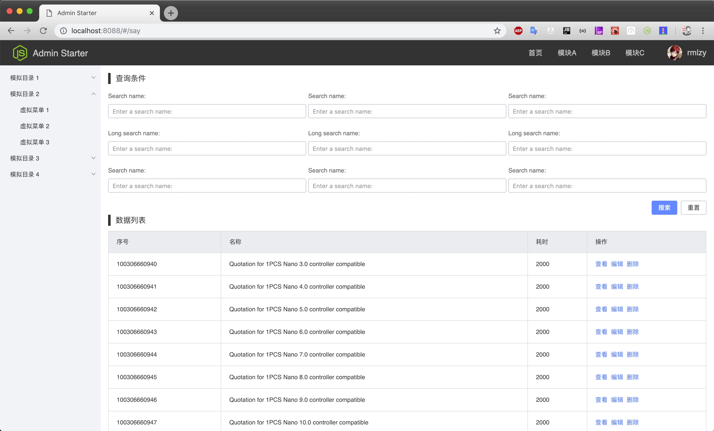
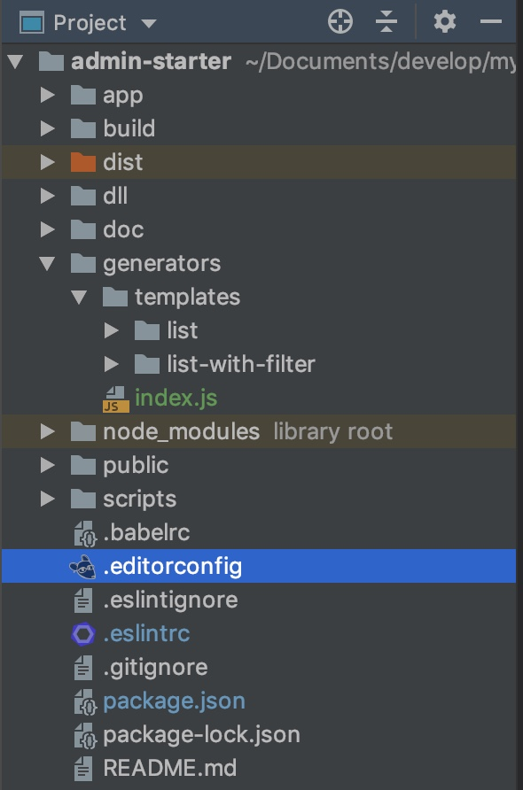

对于中台系统, 由 "搜索条件 + 数据表格" 组成的页面非常多, 如下图:



我们可以通过 [plop](https://github.com/amwmedia/plop) 工具提取出模板, 通过终端命令的方式一键生成代码.

通过简单的配置, 我们可以以问答的方式收集一些的变量(比如模板名称, 模板路径, 自定义值...), plop 会将这些变量填充到指定的模板中, 并生成文件.

第一步: 安装 plop 依赖
```bash
npm i --save-dev plop
```

第二步: 在 `admin-starter` 下创建 `generators` 文件夹, 用来存放生成器相关的配置和模板. 结构如下:



第三步: 更新 `package.json`, 添加 `generate` 命令, 还可以设置一个 `g` 别名:

```text
{
    "scripts": {
        // ... 其他配置
        "g": "npm run generate",
        "generate": "plop --plopfile ./generators/index.js"
    }
}
```

第四步: 从上面的 `scripts` 可以看出, 我们指定了 plop 的配置为 `admin-starter/generators/index.js`, 编写如下:

```js
const path = require('path');

const LIST              = '列表页(包含: 表格+底部)';
const LIST_WITH_FILTER  = '列表页(包含: 查询+表格+底部)';

module.exports = function (plop) {
    // controller generator
    plop.setGenerator('controller', {
        description: 'application controller logic',
        prompts: [
            {
                type: 'list',
                name: 'type',
                message: '请选择页面类型:',
                choices: () => [
                    LIST,
                    LIST_WITH_FILTER
                ]
            },
            {
                type: 'input',
                name: 'folder',
                message: '请输入路径(相对于/app/pages/):'
            },
            {
                type: 'input',
                name: 'className',
                message: '请输入 Class 名(大驼峰): ',
                default: 'List'
            }
        ],
        actions: data => {
            const getPath = (fileName) => {
                return path.join('../app/pages/', data.folder, `{{properCase className}}/${fileName}`);
            };

            let actions;
            if (data.type === LIST) {
                const listPath = getPath('index.js');
                const listTemplate = './templates/list/index.hbs';
                const scssPath = getPath('index.scss');
                const scssTemplate = './templates/list/scss.hbs';
                actions = [
                    {
                        type: 'add',
                        path: listPath,
                        templateFile: listTemplate,
                        abortOnFail: true
                    },
                    {
                        type: 'add',
                        path: scssPath,
                        templateFile: scssTemplate,
                        abortOnFail: true
                    }
                ];
            }
            if (data.type === LIST_WITH_FILTER) {
                const listPath = getPath('index.js');
                const listTemplate = './templates/list-with-filter/index.hbs';
                const filterPath = getPath('Filter.js');
                const filterTemplate = './templates/list-with-filter/filter.hbs';
                const scssPath = getPath('index.scss');
                const scssTemplate = './templates/list-with-filter/scss.hbs';
                actions = [
                    {
                        type: 'add',
                        path: listPath,
                        templateFile: listTemplate,
                        abortOnFail: true
                    },
                    {
                        type: 'add',
                        path: filterPath,
                        templateFile: filterTemplate,
                        abortOnFail: true
                    },
                    {
                        type: 'add',
                        path: scssPath,
                        templateFile: scssTemplate,
                        abortOnFail: true
                    }
                ];
            }
            return actions;
        }
    });
};
```

第五步: 编写对应的模板, 由于代码量较多, 请参照 [commit]().

第六步: 执行 `npm run g`:
1. 选一个模板
2. 选一个路径
3. 设置一个类名

之后会在 `admin-starter/app/pages` 生成对应的文件, 再改下路由就可以在页面看到效果了.


